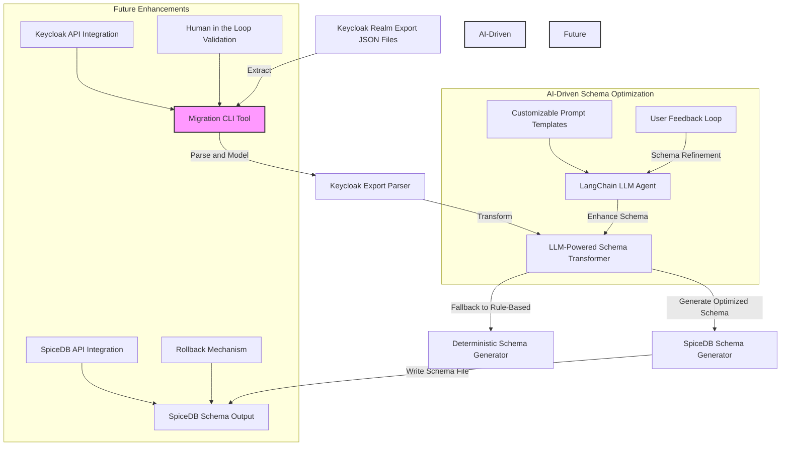

# **Keycloak to SpiceDB Migration Tool**

## **High-Level System Architecture**

This migration tool automates the transformation of **Keycloak realms** into **SpiceDB schemas**, leveraging **LangChain-powered LLMs** for intelligent schema optimization instead of a simple 1:1 mapping.

### **Updated Mermaid Diagram**


---

## **Data Flow Explanation**
1. **Input Extraction (Keycloak Realm Export)**
   - The user provides a **Keycloak realm export JSON** file.

2. **Parsing & Modeling**
   - The **Keycloak Export Parser** processes the JSON, extracting:
     - **Realm roles**
     - **Client roles**
     - **Groups & Subgroups**
     - **Composite role mappings**

3. **LLM-Powered Schema Transformation**
   - The **LangChain-powered LLM agent** takes the parsed Keycloak data and generates an **optimized** SpiceDB schema.
   - The schema **is not just a 1:1 conversion**—it **restructures relationships intelligently** for better maintainability and performance.

4. **Fallback to Deterministic Schema Generation**
   - If the **LLM fails** or is disabled (`--no-llm` flag), a **rule-based** schema generator provides a **basic** deterministic conversion.

5. **Schema Output**
   - The generated **SpiceDB `.zed` schema** is saved to the specified output path.

6. **AI-Driven Schema Optimization Features**
   - **Customizable Prompts:** Allows fine-tuning the LLM’s schema generation behavior.
   - **User Feedback Loop:** Users can provide refinements to improve the model’s output.
   - **Auto-Enhancements:** The LLM suggests schema optimizations based on best practices.

7. **Future Enhancements**
   - **Keycloak API Integration:** Fetch Keycloak realms dynamically without requiring JSON exports.
   - **SpiceDB API Integration:** Directly push schema updates to SpiceDB.
   - **Human-in-the-Loop Validation:** Introduce an approval step before applying schema changes.
   - **Rollback Mechanism:** Implement schema versioning to **undo changes if needed**.

---

## **CLI User Experience**
The CLI tool follows an **intelligent, interactive process**:

### **Basic Migration**
```bash
$ k2spicedb migrate --realm-export realm.json --out schema.zed -v
```
- **LLM is enabled by default** for schema enhancement.
- **If additional input is required, the tool will prompt the user.**
- **Verbose mode (`-v`) provides insights** into transformations.

### **Disable AI (Rule-Based Fallback)**
```bash
$ k2spicedb migrate --realm-export realm.json --out schema.zed --no-llm
```
- Uses a **deterministic rule-based transformation** without AI-powered optimizations.

### **Preview LLM Schema Suggestions**
```bash
$ k2spicedb preview --realm-export realm.json
```
- **Outputs a suggested schema without writing to disk.**
- **Allows users to review AI-generated transformations before applying them.**

---

## **Future Work**
- **Support for concurrent processing** to handle large Keycloak realms efficiently.
- **LLM fine-tuning** to improve schema recommendations based on real-world migration cases.
- **Advanced error handling** to detect and auto-correct inconsistencies in Keycloak data.
- **Logging & monitoring improvements** to track schema changes over time.

---

## **Summary**
This tool **streamlines the transition from Keycloak to SpiceDB**, leveraging **AI-driven schema transformation** to generate **optimized, maintainable** access control schemas. 🚀
